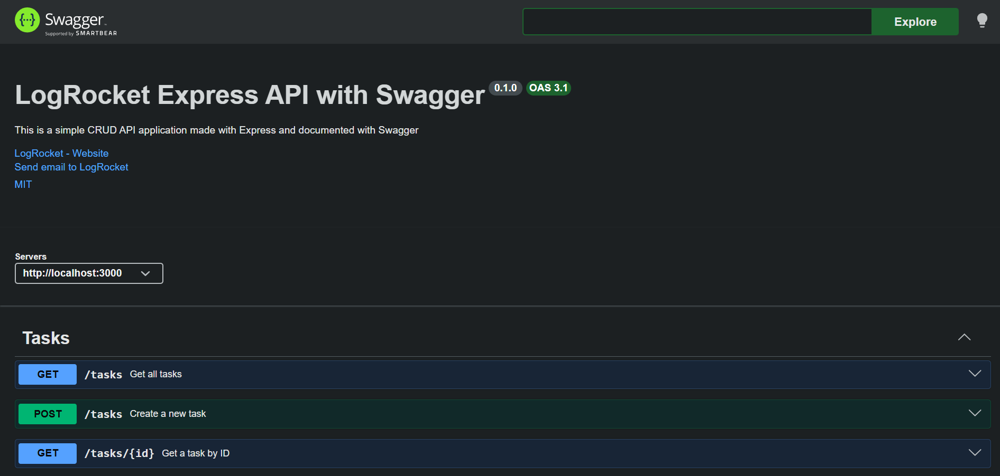

# Task API

This is a small Express CRUD API for managing in-memory tasks. It includes a Swagger UI page for interactive API docs.

## Install and Run

```bash
npm install
npm start
```

The server runs on `http://localhost:3000` by default. If you want a different port, set `PORT` in a `.env` file.

## Endpoints

| Method | Route | Description |
| --- | --- | --- |
| GET | `/` | Basic API info |
| GET | `/health` | Health check |
| GET | `/tasks` | List all tasks |
| GET | `/tasks/:id` | Get one task by id |
| POST | `/tasks` | Create a new task |
| PUT | `/tasks/:id` | Update a task |
| DELETE | `/tasks/:id` | Delete a task |
| GET | `/api-docs` | Swagger UI |

## Example curl Output

```bash
curl -i http://localhost:3000/health
```

```http
HTTP/1.1 200 OK
Content-Type: application/json; charset=utf-8
Content-Length: 15

{"status":"ok"}
```

## Swagger Screenshot

Add a screenshot of the Swagger UI here after running the app and opening `/api-docs`.
